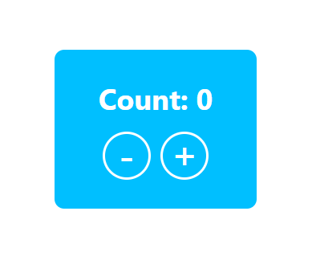

# React Testing Library coding dojo

This is a simple template for a super simple coding dojo to introduce React Testing Library to people who haven't got any experience working with it yet.

## Task 1

We're going to build a counter, similar to the one below, in the next task.

Now, think for a second, what would you test?

## Task 2

Go to `src/components/Counter.test.tsx` and start writing the tests! There are some todos you might find helpful. If you want, you can jump between tasks 2 and 3, TDD style.

## Task 3

Actually implement the counter (there are also some styles prepared if you want to get fancy).
